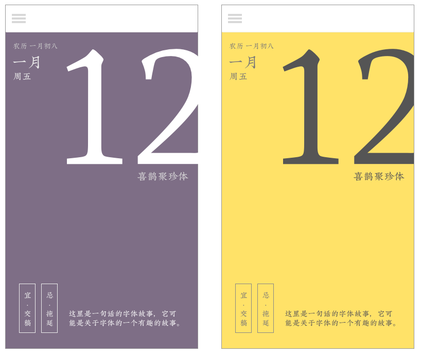

# 2019 字体日历 App

这是目前正在着手做的移动端 App，预计 2018 年年底上线，欢迎关注制作的进展。

如果想第一时间收到 App 上线通知，请关注[这个 issue](https://github.com/Ovilia/2019-typography-calendar/issues/4) 以及我的微博[羡辙](http://weibo.com/plainjane)。

## TODOs

- [x] 历史页面：看到之前撕下的日历页列表
- [ ] 文字大小调整
- [ ] 撕日历的动画
- [x] 日历话术 x 30
- [x] 从字体文件生成日期的图片
- [x] 存储撕的页数
- [x] 字体版权说明页
- [ ] App Store 物料准备
- [ ] 封面
- [ ] 底页
- [ ] Logo

测试：
- [x] 多个撕下页面后的效果
- [x] 字体效果检验
